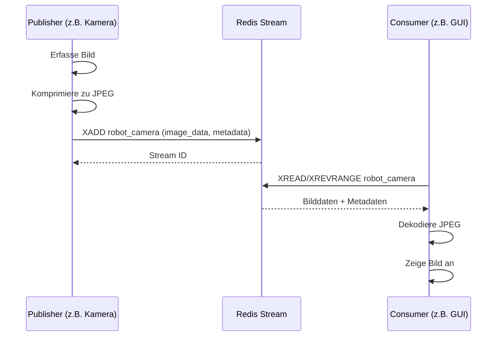
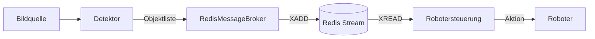

# Datenfluss

Der Datenaustausch erfolgt asynchron über Redis Streams. Dies ermöglicht eine Entkopplung von Produzenten (z. B. Kamera-Treiber, KI-Modelle) und Konsumenten (z. B. Robotersteuerung, Visualisierung).

## Bild-Streaming-Sequenz

## Objekterkennungs-Workflow

