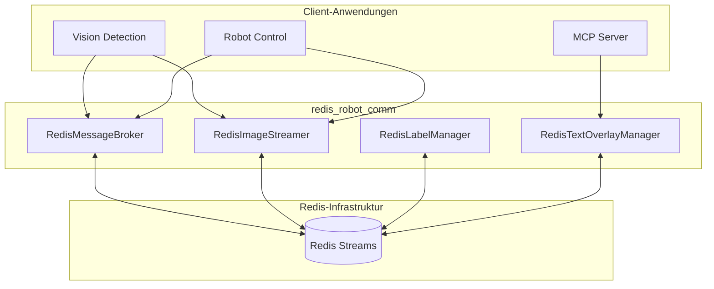

# Architektur-Übersicht

## Systemdesign

Das System basiert auf einer dezentralen Architektur, bei der Redis als zentraler Message Broker für alle Datenströme fungiert.

### Komponenten-Diagramm

## Kernkomponenten

### RedisMessageBroker
Zuständig für das Streaming von Objekterkennungsdaten im JSON-Format. Unterstützt Kameraposen und Zeitstempel.

### RedisImageStreamer
Ermöglicht das Streaming von OpenCV-Bildern mit optionaler JPEG-Kompression. Optimiert für niedrige Latenz.

### RedisLabelManager
Verwaltet dynamisch die Liste der erkennbaren Objekte zwischen verschiedenen Prozessen.

### RedisTextOverlayManager
Synchronisiert Texteinblendungen für Videoaufzeichnungen, unterteilt in Benutzeraufgaben, Robotersprache und Systemnachrichten.
