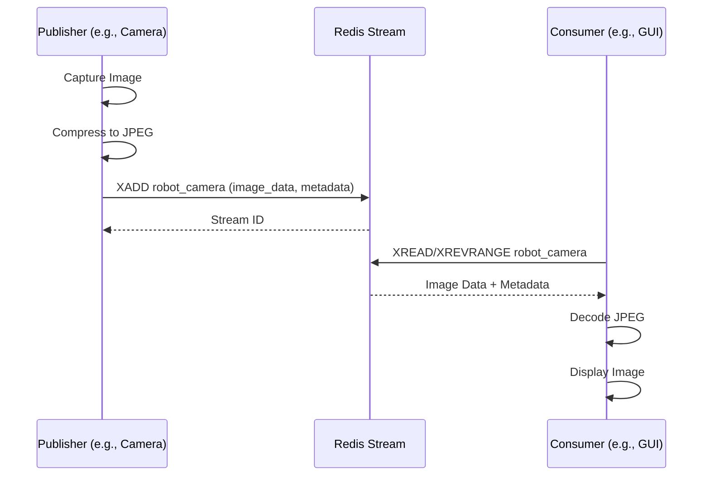
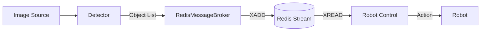

# Data Flow

Data exchange occurs asynchronously via Redis Streams. This allows for decoupling of producers (e.g., camera drivers, AI models) and consumers (e.g., robot control, visualization).

## Image Streaming Sequence

## Object Detection Workflow

