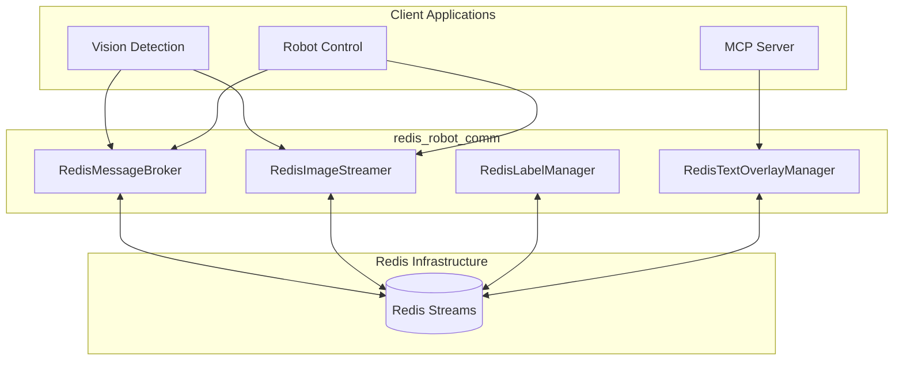

# Architecture Overview

## System Design

The system is based on a decentralized architecture where Redis acts as the central message broker for all data streams.

### Component Diagram

## Core Components

### RedisMessageBroker
Responsible for streaming object detection data in JSON format. Supports camera poses and timestamps.

### RedisImageStreamer
Enables streaming of OpenCV images with optional JPEG compression. Optimized for low latency.

### RedisLabelManager
Dynamically manages the list of detectable objects between different processes.

### RedisTextOverlayManager
Synchronizes text overlays for video recordings, categorized into user tasks, robot speech, and system messages.
