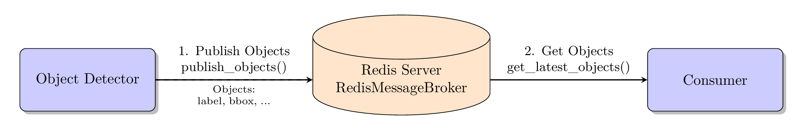

# redis_robot_comm

**Redis-based communication and streaming package for robotics applications.**

The `redis_robot_comm` package provides an efficient Redis-based communication infrastructure for robotics applications. It enables real-time exchange of camera images, object detections, metadata, and text overlays between distributed processes or systems.

## Key Features

* 📦 **Object Detection** - Streaming of detection results via `RedisMessageBroker`
* 📷 **Image Streaming** - Variable image sizes with JPEG compression via `RedisImageStreamer`
* 🏷️ **Label Management** - Dynamic object labels with `RedisLabelManager`
* 📝 **Text Overlays** - Video recording integration with `RedisTextOverlayManager`
* ⚡ **Real-Time Performance** - Sub-millisecond latency for local Redis servers
* 🔄 **Asynchronous Architecture** - Decoupled producer-consumer patterns
* 📊 **Rich Metadata Support** - Automatic timestamps, camera poses, workspace information
* 🎯 **Robotics-Optimized** - Specifically designed for pick-and-place and computer vision tasks

## Use Cases

This package serves as the communication backbone for robotics frameworks:

- **vision_detect_segment** - Object detection with OwlV2, YOLO-World, YOLOE, Grounding-DINO
- **robot_environment** - Robot control with visual object recognition
- **robot_mcp** - LLM-based robot control using Model Context Protocol (MCP)

## Data Flow

